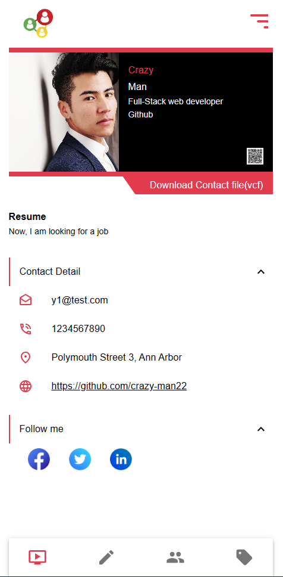
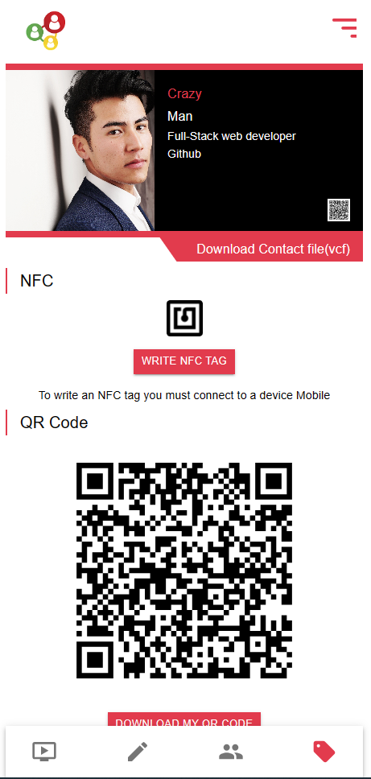
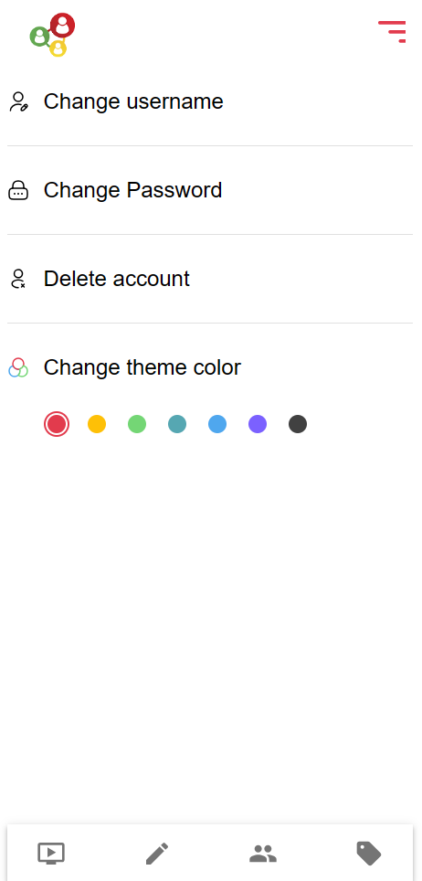

  

  <h3 align="center">React Contact Sharing</h3>

  

    <a href="https://react-contact-sharing-nfc.vercel.app/">View Demo</a>
    ·
    <a href="https://github.com/crazy-man22/react-contact-sharing-nfc/issues">Report Bug</a>
    ·
    <a href="https://github.com/crazy-man22/react-contact-sharing-nfc/issues">Request Feature</a>
  

 

  
  
View Page

  
  
NFC and Qrcode

  
  
Setting Page

## Prerequests

- Create a Firebase project.
- Create a file named `.env`, and copy and paste the content of `.env.example`.
  And then paste credentials of the firebase project you just created.

## Features

- How to create and use [Custom Hooks](https://reactjs.org/docs/hooks-custom.html)
- How to use [Context](https://reactjs.org/docs/context.html) and its provider
- How to customize default theme of [MUI](https://mui.com/)

## Third Party libraries used except for React and RTK

- [firebase](https://firebase.google.com/)
- [react-router-dom@v6.5](https://reactrouter.com/en/main)
- [MUI(Material UI)](https://mui.com/)
